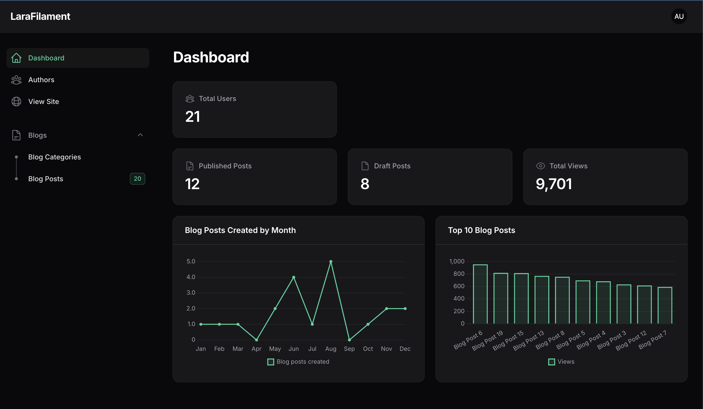
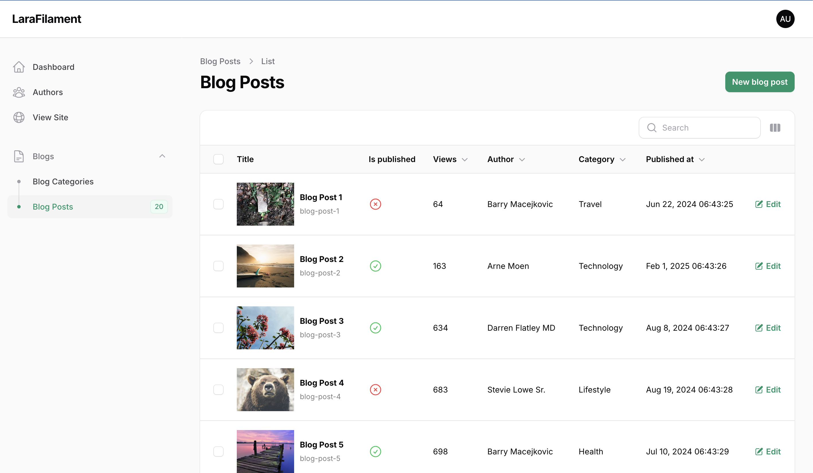
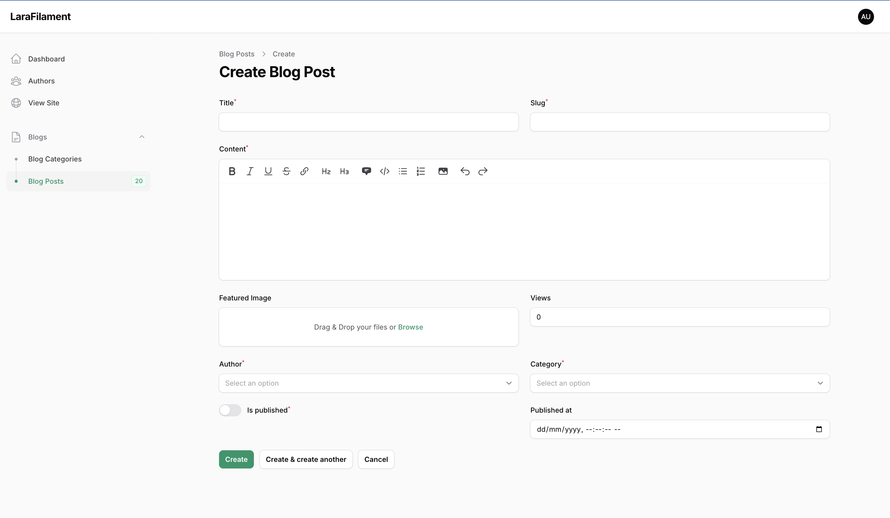

## LaraFilament

A simple blog management using FilamentPHP with Laravel 11.x by Maniruzzaman Akash

----

## Installation

1. Clone the repository:

    ```bash
    git clone git@github.com:ManiruzzamanAkash/LaraFilament.git
    cd LaraFilament
    ```

2. Install dependencies:

    ```bash
    composer install
    npm install
    ```

3. Copy the `.env.example` file to `.env` and configure your environment variables:

    ```bash
    cp .env.example .env
    ```

4. Generate an application key:

    ```bash
    php artisan key:generate
    ```

5. Run migrations:

    ```bash
    php artisan migrate
    ```

6. Seed the database (optional):

    ```bash
    php artisan db:seed
    ```

7. Serve the application:
    ```bash
    php artisan serve
    npm run dev
    ```

## Features

-   **Author Management**

    -   List authors
    -   Create new author
    -   Edit author details
    -   Delete author

-   **Blog Category Management**

    -   List blog categories
    -   Create new blog category
    -   Edit blog category
    -   Delete blog category

-   **Blog Management**

    -   List blogs
    -   Create new blog
    -   Edit blog
    -   Delete blog

-   **Dashboard**
    -   User statistics charts
    -   Blog statistics charts
    -   Other relevant metrics

## Screenshots

### Login Page
<b>Login Page UI - Dark mode</b>


### Dashboard

<b>Dashboard Page UI - Lite mode</b>


<b>Dashboard Page UI - Dar mode</b>


### Author Management
<b>Author Page UI - Lite mode</b>


### Blog Category Management
<b>Blog Category Page UI - Lite mode</b>


### Blog Management
<b>Blog Page UI - Lite mode</b>


<b>Blog Create Page UI - Lite mode</b>


## Mobile responsive View
<b>Dashboard Page UI Mobile - Dark mode</b>


## Contributions
Any contribution is welcomed, please raise a PR. Any more talks, just ping me - manirujjamanakash@gmail.com